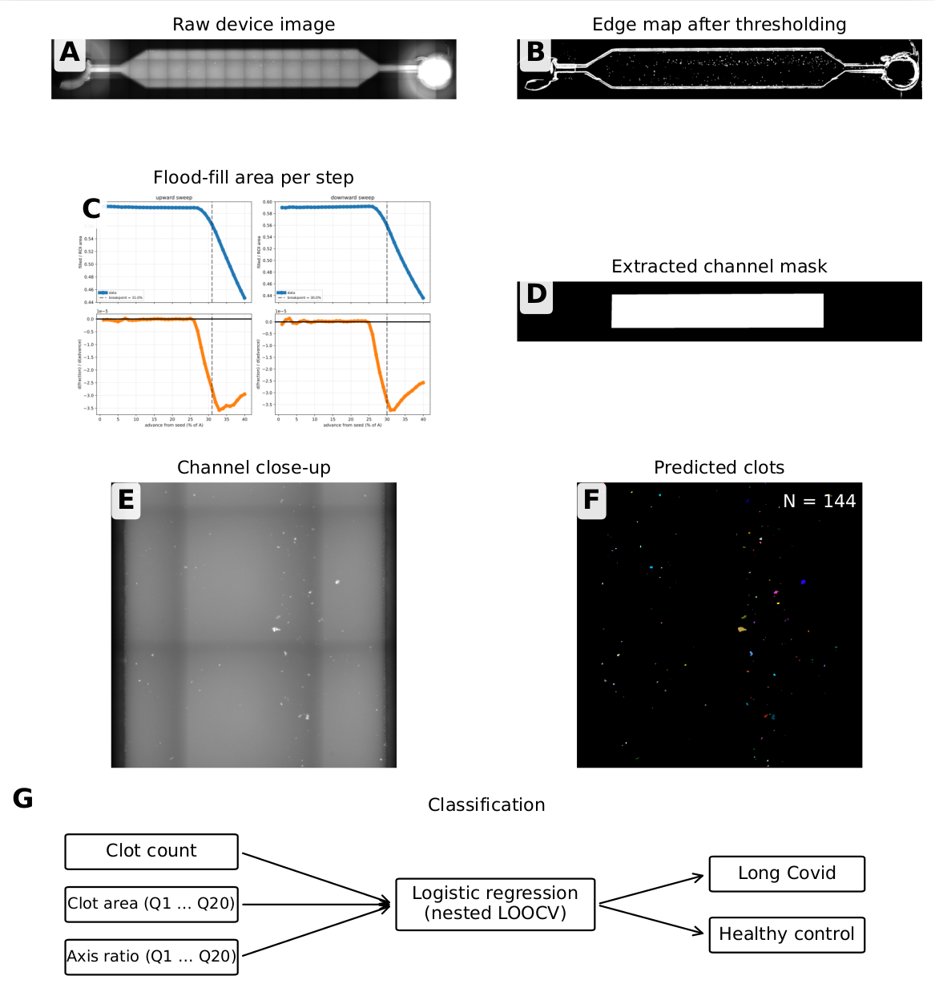
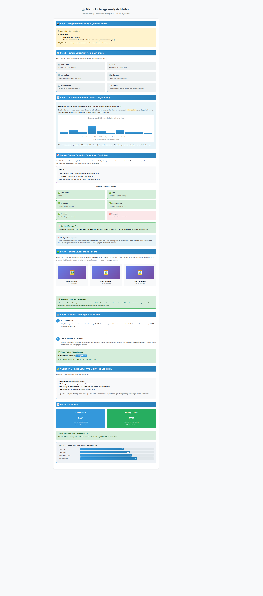

# Microclots

Automated, machine-learning analysis of microclots imaged in a microfluidic device. The pipeline locates the central channel, segments the clots inside it, and turns their shapes into per-image features. A logistic regression model then uses those features to tell Long COVID (LC) and healthy control (HC) samples apart. Across 42 LC and 14 HC patients it reaches roughly 80% accuracy as a proof of principle.

> **Under construction.** Full installation and usage instructions will follow shortly.

## Segmentation

The central channel is isolated with an edge-based estimate followed by a flood-fill that stops where the channel meets the funnels; the outline is then fit to a clean rectangle. A neural network segments individual clots inside the channel crop, and per-clot shape statistics are read off the result.

**Figure 1.** (A) Raw device image. (B) Thresholded edge map. (C) Area added per flood-fill step. (D) Rectangular channel mask. (E) Channel close-up. (F) The same crop, segmented. (G) Assembly of the classifier input.

## Classification

Clot features feed a logistic regression classifier that labels each sample LC or HC, with feature subsets chosen by Optuna under leave-one-out cross-validation.

**Figure 2.** Logistic regression pipeline and feature selection.

## Segmentation network

The network used here differs slightly from the base architecture; the actual one will be released after legal approval. Microclot segmentation labels are available on request.

## Study
 
This work was led by Massachusetts General Hospital (MGH).
 
Kirandeep K. Gill, Laurids Stockert, Bryan Alvarez-Carcamo, Jaime Greatorex, Carly Steifman, Zoe Swank, David R. Walt, Michael B. VanElzakker, Lael M. Yonker, Daniel Irimia\*
 
\*Corresponding author: Daniel Irimia.
 
A preprint will follow shortly.
 

